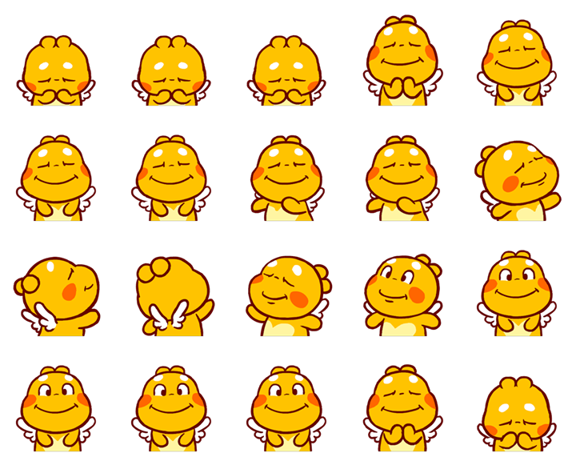

kennynguyeenx/facebook-sticker
=============

> Create animated Facebook stickers

Features
--------

- Create animated Facebook stickers
- Dependencies: imagemagick
- PSR-4 compatible.
- Compatible with PHP >= PHP 7.

Installation
------------

- You can download facebook-sticker through https://github.com/kennynguyeenx/facebook-sticker.

- facebook-sticker requires the Imagick extension and GD extension from PHP.
 
- Imagick is a native php extension to create and modify images using the ImageMagick API.
More information can be found in the [PHP documentation](http://php.net/manual/en/intro.imagick.php).

- You will need to compile PHP with the GD library of image functions.
More information can be found in the [PHP documentation](http://php.net/manual/en/intro.imagick.php).

- You need to change owner of some folders like cache or images if needed 

Usage
-----

- Create animated Facebook sticker:

```php
use Kennynguyeenx\FacebookSticker\FacebookSticker;

try {
    $facebookSticker = new FacebookSticker();
    $facebookSticker->createAnimatedSticker(
        $sourceImagePath,
        $destinationImagePath,
        $numOfRows,
        $numOfCols,
        $numOfFrames
    );
} catch (Exception $exception) {
    // Handle exception
}
```
- I created a file to run in console to create animated Facebook stickers as an example of using this class

- It's located at bin directory with name create_sticker.php

- You can follow these steps to create your own animated Facebook sticker:

1. Open a Messenger chat session and send your friend the animated sticker you'd like to have.

2. Right-click the sticker you just sent. Click "inspect" and you can see:


3. Right-click on that highlighted URL, click "open".

4. Right-click on the new-opened image, save it under the folder that you want. For me, i save it under images/source folder as example-sticker.png

5. Open that image and take a look. For example:



The format of this sticker is:

```
X  X  X  X  X
X  X  X  X  X
X  X  X  X  X
X  X  X  X  X
```

So this image have 4 rows, 5 columns and 20 frames, let's pass parameters for create_sticker.php file accordingly. 

Let me give you another example. If there's another sticker which has a format like this:

```
X  X  X  X  X
X  X  X  X  X
```

Then you should pass 2 rows, 5 columns and 10 frames this time. As well as:

```
X  X  X  X
X  X  X  X
X  X  X  X
X  X  X
```
 
Pass 4 rows, 4 columns and 19 frames.

For example: you can run this command to create animated Facebook sticker with example image above

```
$ php ./bin/create_sticker.php ./images/source/example-stickers.png ./images/destination/animated.gif 4 5 20
```

